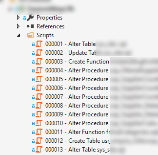
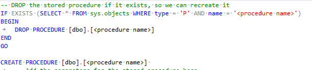

We use [DbUp](https://dbup.github.io/) at work to manage database changes and migrations and for the most part it works fine as long as you have a known schema that you're coming from. The downside of the current implementation is that changes to stored procedure definitions are not easily reviewable in source control. Fortunately enabling this workflow with DbUp is relatively straightforward.

## Project format

Our DbUp project looks fairly standard:



DbUp takes care of running the scripts and making sure none are run more than once via its in build journaling system, a record of which is also stored in the database. The problem is that those "Alter Procedure" scripts all simply have a full copy of the stored procedure in them, even if those half-dozen files are all changing the same stored procedure.

The first step in enabling reviewable stored procs and views is to create a new folder for scripts that will be unjournaled, so they are always run whenever DbUp is run. I'm going to just call this StoredProcs for now as thats the first thing I 'll be moving across.

The basic idea is that you use that folder for SQL scripts that contain a simple DROP and CREATE script for each stored procedure. DbUp runs these scripts every time, essentially making sure the database definition is always correct, and allowing developers to make changes to the existing scripts in the source repository, rather than having to create new ones all the time, as with normal migration scripts.



## The DbUp script runner

The existing DbUp script runner looks fairly basic, like this:

```csharp
var upgrader = DeployChanges.To
               .SqlDatabase(connectionString)
               .WithScriptsEmbeddedInAssembly(Assembly.GetExecutingAssembly())
               .LogToConsole()
               .JournalToSqlTable("dbo", "SchemaVersions")
               .WithTransaction()
               .Build();
```

We need to add a new upgrader to this script and instead of storing the journal in a table we will use the `NullJournal` that is build into DbUp

```csharp
var storedProcUpgrader = DeployChanges.To
               .SqlDatabase(connectionString)
               .WithScriptsEmbeddedInAssembly(Assembly.GetExecutingAssembly())
               .LogToConsole()
               .JournalTo(new NullJournal())
               .WithTransaction()
               .Build();
```

The last piece of the puzzle is to put a filter onto each upgrader so each one only loads the scripts we want. The final code looks like this:

```csharp
public static int Main()
{
    var connectionString = ConfigurationManager.ConnectionStrings["ConnectionString"].ConnectionString;

    var upgrader = DeployChanges.To
        .SqlDatabase(connectionString)
        .WithScriptsEmbeddedInAssembly(Assembly.GetExecutingAssembly(), s => !IsStoredProc(s))
        .LogToConsole()
        .JournalToSqlTable("dbo", "SchemaVersions")
        .WithTransaction()
        .Build();

    var storedProcUpgrader = DeployChanges.To
        .SqlDatabase(connectionString)
        .WithScriptsEmbeddedInAssembly(Assembly.GetExecutingAssembly(), s => IsStoredProc(s))
        .LogToConsole()
        .JournalTo(new NullJournal())
        .WithTransaction()
        .Build();

    // migrate the database data, and table schema changes first
    if (!UpgradeAndLog(upgrader))
    {
        return 1;
    }
    // now we can change stored procs that rely on the adjusted schema
    if (!UpgradeAndLog(storedProcUpgrader))
    {
        return 1;
    }

    Console.ForegroundColor = ConsoleColor.Green;
    Console.WriteLine("Success!");
    Console.ResetColor();
    return 0;
}

private static bool UpgradeAndLog(DbUp.Engine.UpgradeEngine upgrader)
{
    var result = upgrader.PerformUpgrade();
    if (!result.Successful)
    {
        Console.ForegroundColor = ConsoleColor.Red;
        Console.WriteLine(result.Error);
        Console.ResetColor();
        return false;
    }
    return true;
}

private bool IsStoredProc(string scriptName)
{
    return (scriptName.StartsWith("My.NameSpace.StoredProcs.", StringComparison.OrdinalIgnoreCase));
}
```

## Get reviewing

Every change to the stored proc of view definition script will be just that - a change - so whatever source repository diff process you use will show only what has been done. Additionally you always have the current up-to-date definitions of your scripts in your source repository so you're one step closer to not having to worry about having a known good starting point for your database, at least from the schema point of view.

So far we're rolling this out on a change-by-change basis, but there is no reason all of the relevant parts of the database couldn't be scripted to seed this effort giving you a known baseline.

This same theory applies to Views or Functions, or anything else where a migration script would need to contain the entire definition, and dropping the object is not a destructive operation.