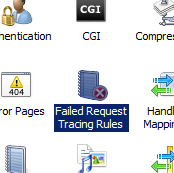

Where I work we have a number of ASP.NET web applications that run different parts of our site so that we can have some segregation of code and containment of scope without just having an enormous monolithic project that holds everything intermingled together. It's nothing too exciting technically, but the marketing department also needs to be able to present the entire site as a whole to visitors, and the Google Bot, for that sweet sweet SEO juice (and easier navigation and other less cynical reasons I'm sure). The way we achieve that is with prodigious use of the IIS URL Rewrite engine, which allows us to create a set of rules that take the incoming HTTP requests and either route them through to different web applications, or different virtual paths, or stop some in their tracks entirely.

There is lots of documentation and examples on the web about setting these up, and I certainly don't claim to be an expert in the full range of their capabilities, but one thing I do know is that whilst they are fantastic when they are working, and just sit there happily doing their job without complaint, when adding new ones it can sometimes appear to be a bit of a mystery as to whether they are working. Additionally, because we use them to consolidate a lot of different applications and URLs into one coherent set of public URLs, getting them running locally quickly ends up with requests to local environments being redirected to live environments, with no real way of knowing if it was because the rules are working perfectly, or simply because they fell through to some catch all at the end.

Fortunately there is a way to debug the rules, or at least get logging out of the engine, albeit a little hidden.

## Not all failures are failures

The answer lies in the IIS Failed Request Tracing feature and the fact that it is possible to configure it to trace successful requests just as easily as failed ones. The feature can be access through the IIS manager or the configuration can be specified in the `web.config` file of your application.

